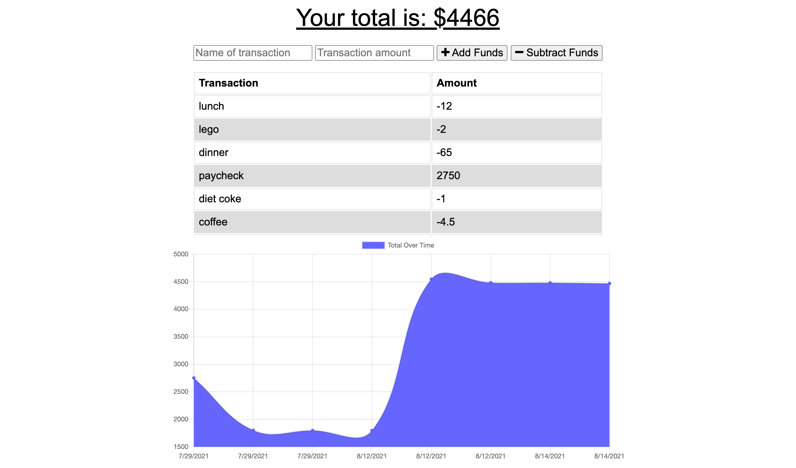

### Budget Tracker

## Description

This budget tracker will allow you to add expenses and deposits to your budget with or without a data/internet connection. Avid travelers who like to keep tabs on their finances will find this app useful as it's not uncommon to be disconnected while exploring new places.

## Table of Contents

- [Usage](#Usage)
- [License](#License)
- [Questions](#Questions)
- [Acknowledgements](#Acknowledgements)

## Usage

This app is deployed with Heroku, and is powered by MongoDB: [Budget Tracker](https://valerie-budget-tracker.herokuapp.com/). Enter deposits and withdrawals and view your trends in a graph below the transactions list. You can use this app offline with full functionality. All entries will be saved as soon as you connect your device to a data or internet connection.

## License

MIT

## Questions

For additional information please contact me via GitHub at [https://github.com/vmichalecki](https://github.com/vmichalecki) or via email at [valerie2273@gmail.com](mailto:valerie227@gmail.com?subject=[GitHub]%Budget%Tracker).

## Acknowledgements

Miguel Alicea: [https://github.com/malicea0783](https://github.com/malicea0783)

